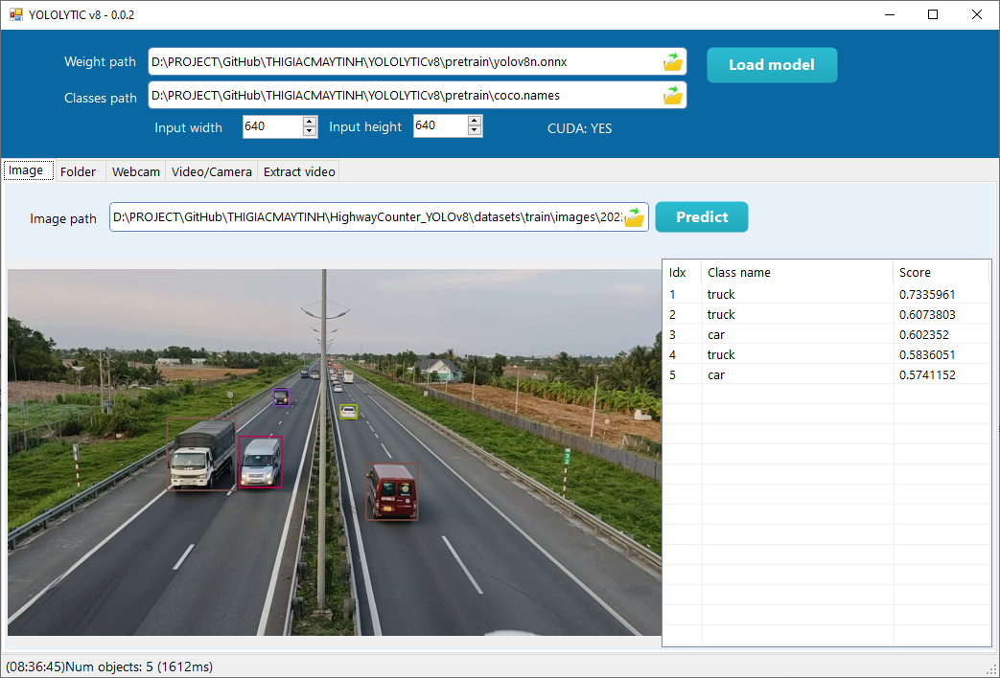

# YOLOLYTICv8

Phần mềm kiểm thử độ chính xác Object Detection YOLO v8. Chương trình chạy trên Windows 10 x64, chỉ sử dụng CPU, dành cho máy tính không có GPU.

Ngoài ra các bạn có thể reference vào chương trình viết bằng .NET framework (C#, VB.NET).

## Chức năng

1. Detect object trong ảnh tĩnh

2. Detect object trong folder

3. Detect object trong webcam

4. Detect object trong video hoặc camera stream

5. Extract camera frame và bouding box
Dùng để retrain

## Hướng dẫn sử dụng

Các bạn cần cài đặt:

**C++ 2022 x64**: https://aka.ms/vs/17/release/vc_redist.x64.exe

**.NET framework 4.7.2**: https://dotnet.microsoft.com/en-us/download/dotnet-framework/thank-you/net472-offline-installer

## Cách convert file pt sang onnx

Sử dụng command sau, lưu ý bạn phải cài đặt YOLO v8 thành công

`!yolo export model='./yolov8n.pt' imgsz=640,640 format=onnx opset=12 simplify=True dynamic=False
`

## Bài viết hướng dẫn chi tiết
https://thigiacmaytinh.com/yololytic-phan-mem-phat-hien-vat-the-manh-me-va-de-su-dung/